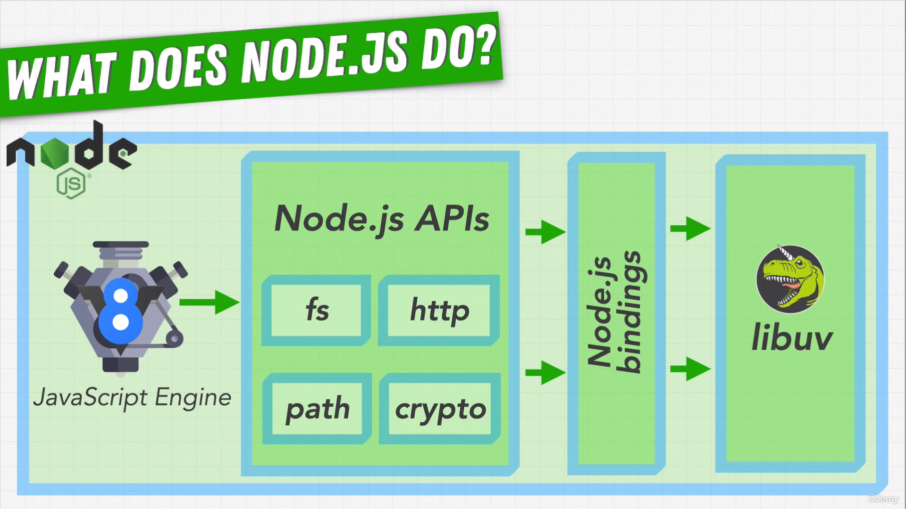
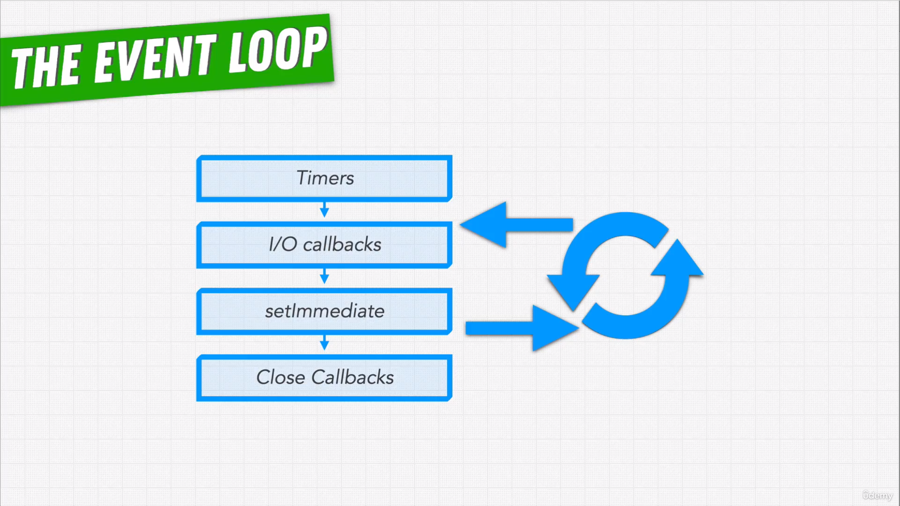

# Complete NodeJS Developer in 2022

###  Node.js - How We Get Here

* How do you run JavaScript?
* JavaScript Engines used by browsers:
  - Google Chrome's **V8** engine
  - Firefox's **SpiderMonkey** engine
  - Safari's **JSC(JavaScriptCore)** engine
* Key moments:
  - 1995: Netscape Navigator launched JavaScript language in the browser.
  - 1996: Netscape Navigator's v3.0 launched a server side JavaScript called LiveWire.
  - 2008: Google launched a poweful engine called V8 to run JavaScript.
  - 2009: Ryan Dahl launched a JavaScript runtime called Node.js to run JavaScript outside of the browser.

### Node.js Runtime

* Node.js combines V8 engine and libuv library to run JavaScript.
* libuv is a C library that provides ability to perfrom asynchronous tasks with event loop.
* Is web browser a JavaScript runtime? YES

**Node System**: A Node.js application essentially interacts with the v8 engine. If a piece of code is outside of v8 engine, such as OS operations, code is passed through node.js bindings that allow to use libraries like libuv to perform that specific action.

* Node.js runtime comes in two versions:
  - LTS(Long Term Support) - Stable and odd version of Node.js
  - Current - Latest and even version of Node.js

### Process argv

Process is an object that Provides information about, and control over, the current Node.js process.

Process argv property returns an array containing the command-line arguments passed when the Node.js process was launched.

[Check Code](./Foundations/hello.js)

### Node VS Browser

| Node.js | Browser |
| ------ | ------ |
| global | window |
| process | document |
| module | history |
| __filename | location |
| require() | navigator |

### Node Internals

The V8 engine is only responsible to execute the javascript code. Rest of the part that need to be executed such as OS operations, network operations, etc. is handled by Node.js. 

These operations are called as Node.js APIs which are later connected to node.js bindings. 

Node bindings, written in higher level language, calls the internal code responsible to handle these operations which is written in low level language such as C/C++. It's connection between JavaScript world and C++ world. 

libuv is the library that handles the I/O operations for Node.js. 

**Is JavaScript a Synchronous or Asynchronous language?**

JavaScript is a synchronous language. Then how does it handle async code in Node.js?

When JavaScript is run in a certain environment like Browser or Node, it allows us to write async functionality. 

It’s the libuv that handles the async tasks in Node:

- File system
- Network

**JavaScript is a single-threaded programming language. Thus the node.** 

Node has only one main thread which:

- runs the V8 engine including Node APIs
- has a super important part of libuv, called, event loop

In node, anytime we call an asynchronous function from JavaScript, such as setTimeout or data fetch, it gets put on the event loop. 

The event loop is what allows Node.js to perform non-blocking I/O operations — despite the fact that JavaScript is single-threaded — by offloading operations to the system kernel whenever possible.

How event loop executes the code?

1. Most of the tasks are done directly in the operating system
2. Using thread pool

In libuv, there is a thread pool set up ahead of time. libuv is a C language having many threads

So in Node,

1) we have a main thread 

2) Thread of pool by libuv

**Myth: All asynchronous operations are handled in the thread pool**

Node actually tries to avoid using thread pool as it's complex. Whenever possible libuv uses the operating system directly, the kernel.

Kernel talks to computer hardware with threads of his own.

Event loop is responsible for handling all these callback functions in Node. Event loop phases:

- Timers
- I/O callbacks
- setImmediate
- Close Callbacks

